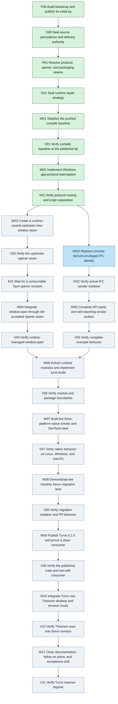

# Dependency projection

Canonical SHA-256: `ba88bd9386d60b246f39d561530253d8be945967ddf2c045e2e57de1e762bb74`

```mermaid
flowchart TD
  P00["P00 Audit bootstrap and publish its initial tip"]
  D00["D00 Seal source precedence and delivery authority"]
  P01["P01 Resolve protocol, opener, and packaging seams"]
  D01["D01 Seal runtime repair strategy"]
  W01["W01 Stabilize the pushed compile baseline"]
  V01["V01 Verify compile baseline at the published tip"]
  W02["W02 Implement Windows app-protocol interception"]
  V02["V02 Verify protocol routing and origin separation"]
  W02I["W02I Replace console-derived privileged IPC identity"]
  V02I["V02I Verify actual IPC sender isolation"]
  W03["W03 Create a runtime-neutral upstream new-window seam"]
  V03["V03 Verify the upstream opener seam"]
  E01["E01 Wait for a consumable Tauri opener revision"]
  W04["W04 Integrate window.open through the accepted opener seam"]
  V04["V04 Verify runtime-managed window.open"]
  W05["W05 Complete API parity and self-reporting smoke probes"]
  V05["V05 Verify complete example behavior"]
  W06["W06 Extract runtime modules and implement turvo-build"]
  V06["V06 Verify module and package boundaries"]
  W07["W07 Build the three-platform native smoke and DevTools lane"]
  V07["V07 Verify native behavior on Linux, Windows, and macOS"]
  W08["W08 Demonstrate the monthly Servo migration lane"]
  V08["V08 Verify migration isolation and PR behavior"]
  W09["W09 Publish Turvo 0.1.0 and prove a clean consumer"]
  V09["V09 Verify the published crate and two-edit consumer"]
  W10["W10 Integrate Turvo into Theorem desktop and browser hosts"]
  V10["V10 Verify Theorem uses one Servo revision"]
  W11["W11 Close documentation, follow-on plans, and acceptance drift"]
  V11["V11 Verify Turvo reaches fixpoint"]
  P00 --> D00
  D00 --> P01
  P01 --> D01
  D01 --> W01
  W01 --> V01
  V01 --> W02
  W02 --> V02
  V02 --> W02I
  W02I --> V02I
  V02 --> W03
  W03 --> V03
  V03 --> E01
  E01 --> W04
  W04 --> V04
  V02I --> W05
  W05 --> V05
  V04 --> W06
  V05 --> W06
  W06 --> V06
  V06 --> W07
  W07 --> V07
  V07 --> W08
  W08 --> V08
  V08 --> W09
  W09 --> V09
  V09 --> W10
  W10 --> V10
  V10 --> W11
  W11 --> V11
  classDef done fill:#d8f3dc,stroke:#2d6a4f,color:#081c15
  classDef frontier fill:#ffe8a1,stroke:#9c6b00,color:#332200
  classDef working fill:#bee3f8,stroke:#2b6cb0,color:#102a43
  classDef pending fill:#edf2f7,stroke:#718096,color:#1a202c
  classDef parked fill:#e9d8fd,stroke:#6b46c1,color:#322659
  classDef failed fill:#fed7d7,stroke:#c53030,color:#3b0d0d
  class P00,D00,P01,D01,W01,V01,W02,V02 done
  class W02I working
  class V02I,W03,V03,E01,W04,V04,W05,V05,W06,V06,W07,V07,W08,V08,W09,V09,W10,V10,W11,V11 pending
```
