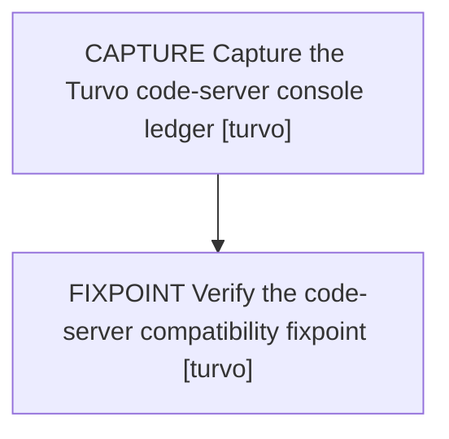

# Dependency projection

Canonical SHA-256: `ab206455c67a6dcc18d7d9af4ac802cf14b2465caf626cc5d64e7e3f88b0dcc2`

```mermaid
flowchart TD
  CAPTURE["CAPTURE Capture the Turvo code-server console ledger [turvo]"]
  FIXPOINT["FIXPOINT Verify the code-server compatibility fixpoint [turvo]"]
  CAPTURE --> FIXPOINT
```
